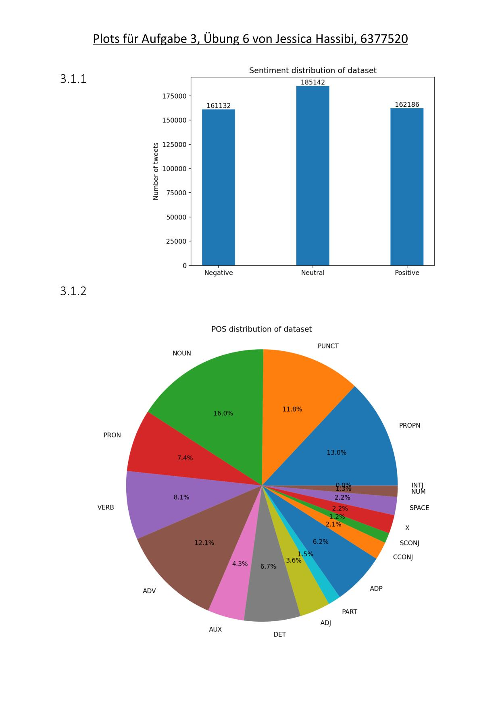
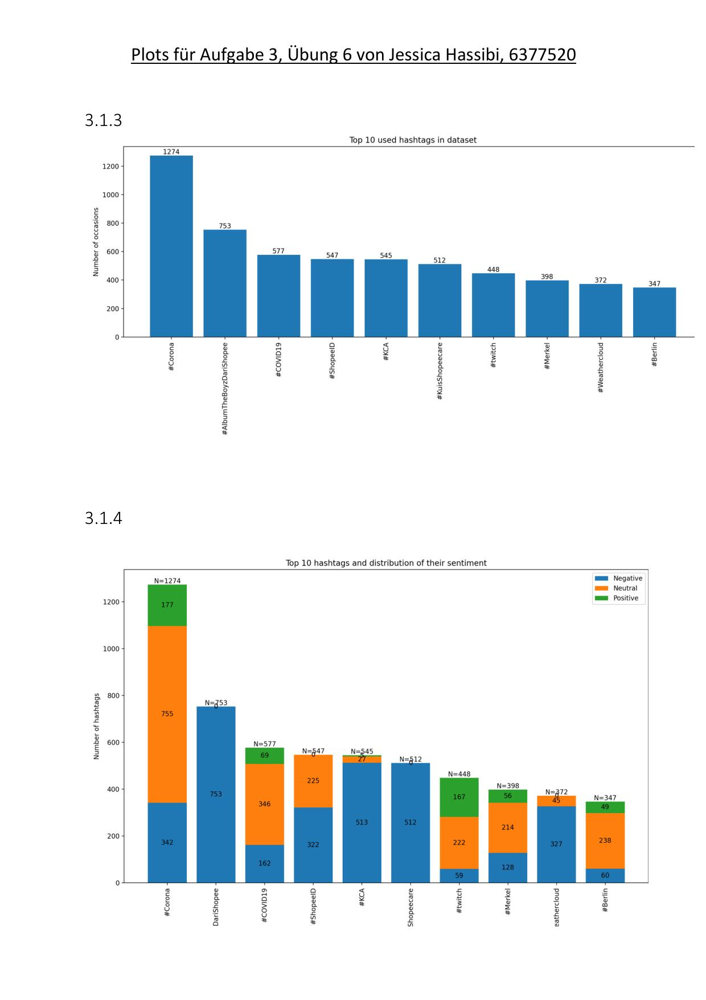
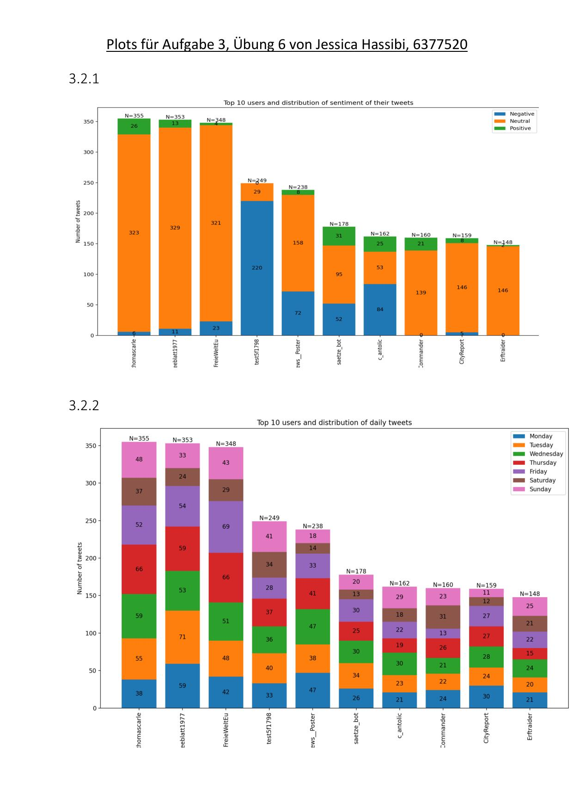
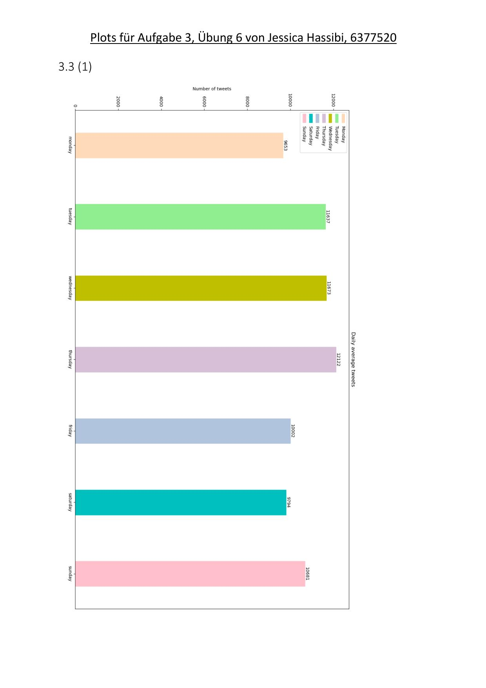
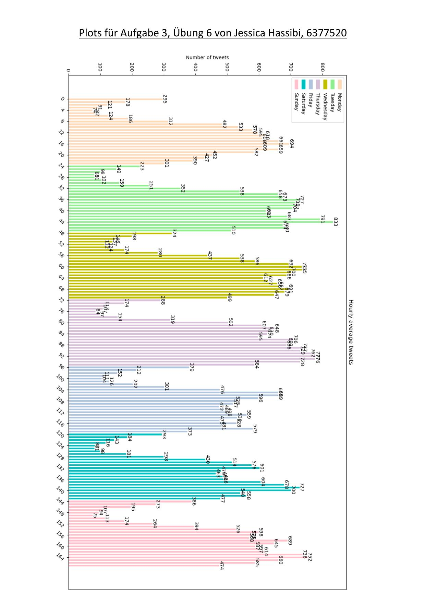
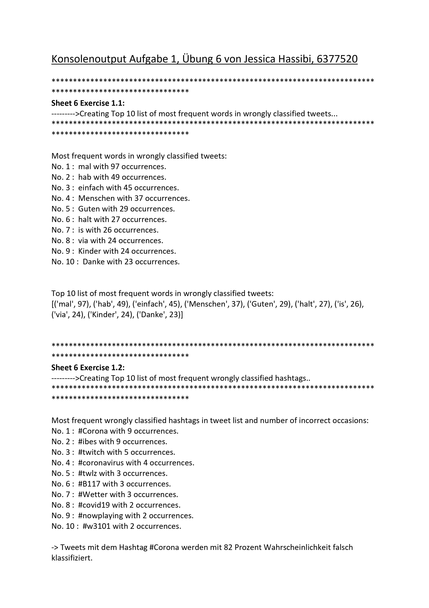
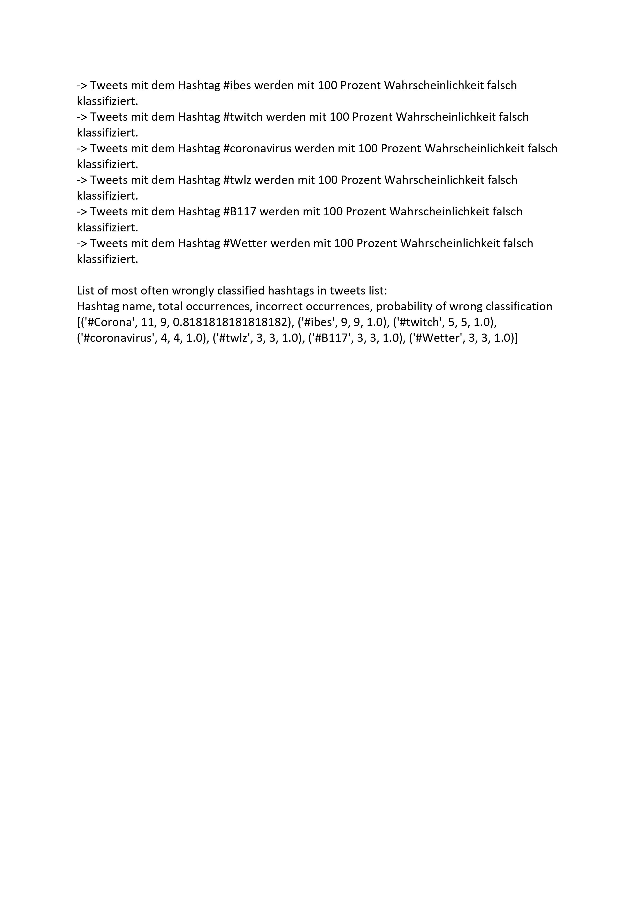

# Uebung6
Author: Jessica Hassibi

### NOTE:
- The best feed forward model was created through exercise 5 (within the task of creating 20 random models and choosing the best one)
and then saved in "results/best_model.pt".
- The code for exercise 6 (uebung6.py) then just loads that model.
- Files provided by university are supposed to be placed in data folder (too large to be uploaded): 'cc.de.100.500000.vec','Disambiguierung.json','filtered_test.json', and 'Twitter_Datensatz.json' 

### Description of Classes and Files:

#### -> Run the program by running uebung6.py <-

- preprocessor.py:
Has already been used for preprocessing the files for uebung5.
Now the new method "preprocess_with_prediction()" is used for 
the preprocessing of files for uebung6 ("filtered_test.json" and "Twitter_Datensatz.json")
which lie in the data folder. Preprocessed files are in "results".
- analyzation_helpers.py:
  Holds the functions used by plotter_uebung6.py to analyze the data in order to plot them.
- plotter_uebung6.py:
  Holds the methods needed for exercise 3 to plot the data.
- krippendorff_alpha_impl.py:
  Thomas Grills Python implementation of Krippendorff's alpha.
- disambiguation_iaa.py:
  Reads annotations from "Disambiguierung.json" and uses krippendorff_alpha_impl.py to calculate iaa score.
  
  
### Results
#### Exercise 3: Plots of Tweet (Sentiment) Distributions

#### Exercise 1: Console Output

